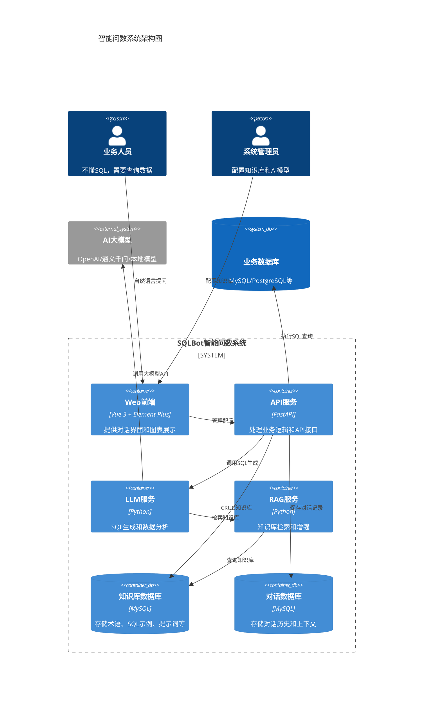

# 智能问数功能设计文档

## 概述

智能问数功能采用大模型+RAG（检索增强生成）架构，通过自然语言理解、SQL生成、数据查询和可视化展示四个核心环节，实现从"业务人员的一句话"到"可执行SQL+可视化图表"的自动化转换。

## 高层架构



## 组件/服务职责表

| 组件/服务 | 职责 | 技术栈 |
|---------|------|--------|
| Web前端 | 对话界面、图表展示、配置管理 | Vue 3 + Element Plus + ECharts |
| API服务 | 业务逻辑处理、路由分发、权限控制 | FastAPI + SQLAlchemy |
| LLM服务 | SQL生成、数据分析、意图识别 | Python + LangChain + OpenAI SDK |
| RAG服务 | 知识库检索、提示词增强 | Python + Vector DB (可选) |
| 知识库数据库 | 存储术语、SQL示例、提示词、业务知识 | MySQL 8.0 |
| 对话数据库 | 存储对话历史、上下文信息 | MySQL 8.0 |
| 业务数据库 | 用户查询的目标数据源 | MySQL/PostgreSQL/SQLite等 |

## 数据模型

### Prisma Schema（转换为SQLAlchemy模型）

```prisma
// AI模型配置表
model AIModelConfig {
  id            Int       @id @default(autoincrement())
  name          String    @db.VarChar(100)  // 模型名称（如：gpt-4, qwen-turbo）
  provider      String    @db.VarChar(50)  // 提供商（openai, alibaba, local）
  api_key       String    @db.Text          // API密钥（加密存储）
  api_base_url  String?   @db.VarChar(500)  // API基础URL
  model_name    String    @db.VarChar(100)  // 具体模型名称
  max_tokens    Int       @default(2000)    // 最大token数
  temperature   Float     @default(0.7)     // 温度参数
  is_default    Boolean   @default(false)   // 是否默认模型
  is_active     Boolean   @default(true)     // 是否启用
  created_at    DateTime  @default(now())
  updated_at    DateTime  @updatedAt
  
  @@index([is_default])
  @@index([is_active])
}

// 术语库表
model Terminology {
  id            Int       @id @default(autoincrement())
  business_term String    @db.VarChar(200)  // 业务术语（如：销售量）
  db_field      String    @db.VarChar(200)  // 数据库字段（如：sales_amount）
  table_name    String?   @db.VarChar(200)  // 所属表名
  description   String?   @db.Text          // 术语说明
  category      String?   @db.VarChar(100)  // 分类
  created_by    Int?                        // 创建人ID
  created_at    DateTime  @default(now())
  updated_at    DateTime  @updatedAt
  
  @@unique([business_term, db_field, table_name])
  @@index([business_term])
  @@index([table_name])
}

// SQL示例库表
model SQLExample {
  id            Int       @id @default(autoincrement())
  title         String    @db.VarChar(200)   // 示例标题
  question      String    @db.Text           // 对应的问题（自然语言）
  sql_statement String    @db.Text           // SQL语句
  db_type       String    @db.VarChar(50)    // 数据库类型
  table_name    String?   @db.VarChar(200)   // 涉及的表名
  description   String?   @db.Text           // 示例说明
  chart_type    String?   @db.VarChar(50)    // 推荐图表类型
  created_by    Int?                        // 创建人ID
  created_at    DateTime  @default(now())
  updated_at    DateTime  @updatedAt
  
  @@index([db_type])
  @@index([table_name])
}

// 自定义提示词表
model CustomPrompt {
  id            Int       @id @default(autoincrement())
  name          String    @db.VarChar(100)   // 提示词名称
  prompt_type   String    @db.VarChar(50)    // 类型（sql_generation, data_analysis等）
  content       String    @db.Text           // 提示词内容
  priority      Int       @default(0)        // 优先级（数字越大优先级越高）
  is_active     Boolean   @default(true)     // 是否启用
  created_by    Int?                        // 创建人ID
  created_at    DateTime  @default(now())
  updated_at    DateTime  @updatedAt
  
  @@index([prompt_type, is_active])
  @@index([priority])
}

// 业务知识库表
model BusinessKnowledge {
  id            Int       @id @default(autoincrement())
  title         String    @db.VarChar(200)   // 知识标题
  content       String    @db.Text           // 知识内容
  category      String?   @db.VarChar(100)   // 分类
  tags          String?   @db.VarChar(500)   // 标签（逗号分隔）
  embedding     String?   @db.Text           // 向量嵌入（JSON格式，可选）
  created_by    Int?                        // 创建人ID
  created_at    DateTime  @default(now())
  updated_at    DateTime  @updatedAt
  
  @@index([category])
  @@fulltext([title, content])  // 全文索引
}

// 对话会话表
model ChatSession {
  id            Int       @id @default(autoincrement())
  user_id       Int                          // 用户ID
  title         String    @db.VarChar(200)   // 会话标题（可编辑）
  data_source_id Int?                        // 关联的数据源ID
  status        String    @db.VarChar(20)    // 状态（active, archived）
  created_at    DateTime  @default(now())
  updated_at    DateTime  @updatedAt
  
  messages      ChatMessage[]
  
  @@index([user_id])
  @@index([data_source_id])
  @@index([status])
}

// 对话消息表
model ChatMessage {
  id            Int       @id @default(autoincrement())
  session_id    Int                          // 会话ID
  role          String    @db.VarChar(20)    // 角色（user, assistant）
  content       String    @db.Text           // 消息内容
  sql_statement String?   @db.Text           // 生成的SQL（assistant角色）
  query_result  String?   @db.Text           // 查询结果（JSON格式）
  chart_config  String?   @db.Text           // 图表配置（JSON格式）
  chart_type    String?   @db.VarChar(50)    // 图表类型
  error_message String?   @db.Text           // 错误信息（如有）
  tokens_used   Int?                         // 使用的token数
  response_time Float?                        // 响应时间（秒）
  created_at    DateTime  @default(now())
  
  session       ChatSession @relation(fields: [session_id], references: [id], onDelete: Cascade)
  
  @@index([session_id])
  @@index([created_at])
}

// 仪表板表
model Dashboard {
  id            Int       @id @default(autoincrement())
  user_id       Int                          // 用户ID
  name          String    @db.VarChar(200)   // 仪表板名称
  description   String?   @db.Text           // 描述
  layout_config String    @db.Text           // 布局配置（JSON格式）
  is_public     Boolean   @default(false)    // 是否公开
  created_at    DateTime  @default(now())
  updated_at    DateTime  @updatedAt
  
  widgets       DashboardWidget[]
  
  @@index([user_id])
  @@index([is_public])
}

// 仪表板组件表
model DashboardWidget {
  id            Int       @id @default(autoincrement())
  dashboard_id  Int                          // 仪表板ID
  widget_type   String    @db.VarChar(50)     // 组件类型（chart, table等）
  title         String    @db.VarChar(200)    // 组件标题
  config        String    @db.Text            // 组件配置（JSON格式）
  position_x    Int       @default(0)         // X坐标
  position_y    Int       @default(0)         // Y坐标
  width         Int       @default(400)       // 宽度
  height        Int       @default(300)       // 高度
  created_at    DateTime  @default(now())
  updated_at    DateTime  @updatedAt
  
  dashboard     Dashboard @relation(fields: [dashboard_id], references: [id], onDelete: Cascade)
  
  @@index([dashboard_id])
}
```

## REST API设计

### OpenAPI 3.1 YAML

```yaml
openapi: 3.1.0
info:
  title: SQLBot智能问数API
  version: 1.0.0
  description: 智能问数功能API接口文档

paths:
  # AI模型配置
  /api/v1/ai-models:
    get:
      summary: 获取AI模型列表
      tags: [AI模型配置]
      responses:
        '200':
          description: 成功
          content:
            application/json:
              schema:
                type: object
                properties:
                  success: {type: boolean}
                  data: {type: array, items: {$ref: '#/components/schemas/AIModelConfig'}}
    
    post:
      summary: 创建AI模型配置
      tags: [AI模型配置]
      requestBody:
        required: true
        content:
          application/json:
            schema: {$ref: '#/components/schemas/AIModelConfigCreate'}
      responses:
        '200':
          description: 创建成功
  
  /api/v1/ai-models/{id}:
    put:
      summary: 更新AI模型配置
      tags: [AI模型配置]
      parameters:
        - name: id
          in: path
          required: true
          schema: {type: integer}
      requestBody:
        required: true
        content:
          application/json:
            schema: {$ref: '#/components/schemas/AIModelConfigUpdate'}
      responses:
        '200':
          description: 更新成功
    
    delete:
      summary: 删除AI模型配置
      tags: [AI模型配置]
      parameters:
        - name: id
          in: path
          required: true
          schema: {type: integer}
      responses:
        '200':
          description: 删除成功
  
  # 术语库
  /api/v1/terminologies:
    get:
      summary: 获取术语列表
      tags: [术语配置]
      parameters:
        - name: keyword
          in: query
          schema: {type: string}
        - name: table_name
          in: query
          schema: {type: string}
      responses:
        '200':
          description: 成功
    
    post:
      summary: 创建术语
      tags: [术语配置]
      requestBody:
        required: true
        content:
          application/json:
            schema: {$ref: '#/components/schemas/TerminologyCreate'}
      responses:
        '200':
          description: 创建成功
  
  # SQL示例库
  /api/v1/sql-examples:
    get:
      summary: 获取SQL示例列表
      tags: [SQL示例配置]
      responses:
        '200':
          description: 成功
    
    post:
      summary: 创建SQL示例
      tags: [SQL示例配置]
      requestBody:
        required: true
        content:
          application/json:
            schema: {$ref: '#/components/schemas/SQLExampleCreate'}
      responses:
        '200':
          description: 创建成功
  
  # 自定义提示词
  /api/v1/prompts:
    get:
      summary: 获取提示词列表
      tags: [自定义提示词]
      parameters:
        - name: prompt_type
          in: query
          schema: {type: string}
      responses:
        '200':
          description: 成功
    
    post:
      summary: 创建提示词
      tags: [自定义提示词]
      requestBody:
        required: true
        content:
          application/json:
            schema: {$ref: '#/components/schemas/CustomPromptCreate'}
      responses:
        '200':
          description: 创建成功
  
  # 业务知识库
  /api/v1/knowledge:
    get:
      summary: 搜索知识库
      tags: [业务知识库]
      parameters:
        - name: keyword
          in: query
          required: true
          schema: {type: string}
        - name: category
          in: query
          schema: {type: string}
      responses:
        '200':
          description: 成功
    
    post:
      summary: 创建知识条目
      tags: [业务知识库]
      requestBody:
        required: true
        content:
          application/json:
            schema: {$ref: '#/components/schemas/BusinessKnowledgeCreate'}
      responses:
        '200':
          description: 创建成功
  
  # 智能问数对话
  /api/v1/chat/sessions:
    get:
      summary: 获取对话会话列表
      tags: [智能问数]
      parameters:
        - name: keyword
          in: query
          schema: {type: string}
      responses:
        '200':
          description: 成功
    
    post:
      summary: 创建对话会话
      tags: [智能问数]
      requestBody:
        required: true
        content:
          application/json:
            schema:
              type: object
              properties:
                title: {type: string}
                data_source_id: {type: integer}
      responses:
        '200':
          description: 创建成功
  
  /api/v1/chat/sessions/{session_id}/messages:
    get:
      summary: 获取会话消息列表
      tags: [智能问数]
      parameters:
        - name: session_id
          in: path
          required: true
          schema: {type: integer}
      responses:
        '200':
          description: 成功
    
    post:
      summary: 发送消息（提问）
      tags: [智能问数]
      parameters:
        - name: session_id
          in: path
          required: true
          schema: {type: integer}
      requestBody:
        required: true
        content:
          application/json:
            schema:
              type: object
              properties:
                content: {type: string}
                data_source_id: {type: integer}
      responses:
        '200':
          description: 成功
          content:
            application/json:
              schema:
                type: object
                properties:
                  success: {type: boolean}
                  data:
                    type: object
                    properties:
                      message_id: {type: integer}
                      sql_statement: {type: string}
                      query_result: {type: object}
                      chart_config: {type: object}
                      chart_type: {type: string}
  
  /api/v1/chat/sessions/{session_id}:
    put:
      summary: 更新会话（重命名）
      tags: [智能问数]
      parameters:
        - name: session_id
          in: path
          required: true
          schema: {type: integer}
      requestBody:
        required: true
        content:
          application/json:
            schema:
              type: object
              properties:
                title: {type: string}
      responses:
        '200':
          description: 更新成功
    
    delete:
      summary: 删除会话
      tags: [智能问数]
      parameters:
        - name: session_id
          in: path
          required: true
          schema: {type: integer}
      responses:
        '200':
          description: 删除成功
  
  # 图表操作
  /api/v1/chat/messages/{message_id}/chart:
    get:
      summary: 获取图表数据
      tags: [智能问数]
      parameters:
        - name: message_id
          in: path
          required: true
          schema: {type: integer}
        - name: chart_type
          in: query
          schema: {type: string}
      responses:
        '200':
          description: 成功
  
  /api/v1/chat/messages/{message_id}/export:
    post:
      summary: 导出数据
      tags: [智能问数]
      parameters:
        - name: message_id
          in: path
          required: true
          schema: {type: integer}
      requestBody:
        required: true
        content:
          application/json:
            schema:
              type: object
              properties:
                format: {type: string, enum: [excel, csv, png]}
      responses:
        '200':
          description: 成功
  
  # 仪表板
  /api/v1/dashboards:
    get:
      summary: 获取仪表板列表
      tags: [仪表板]
      responses:
        '200':
          description: 成功
    
    post:
      summary: 创建仪表板
      tags: [仪表板]
      requestBody:
        required: true
        content:
          application/json:
            schema: {$ref: '#/components/schemas/DashboardCreate'}
      responses:
        '200':
          description: 创建成功
  
  /api/v1/dashboards/{id}/widgets:
    post:
      summary: 添加组件到仪表板
      tags: [仪表板]
      parameters:
        - name: id
          in: path
          required: true
          schema: {type: integer}
      requestBody:
        required: true
        content:
          application/json:
            schema: {$ref: '#/components/schemas/DashboardWidgetCreate'}
      responses:
        '200':
          description: 添加成功

components:
  schemas:
    AIModelConfig:
      type: object
      properties:
        id: {type: integer}
        name: {type: string}
        provider: {type: string}
        model_name: {type: string}
        is_default: {type: boolean}
        is_active: {type: boolean}
    
    AIModelConfigCreate:
      type: object
      required: [name, provider, api_key, model_name]
      properties:
        name: {type: string}
        provider: {type: string, enum: [openai, alibaba, local]}
        api_key: {type: string}
        api_base_url: {type: string}
        model_name: {type: string}
        max_tokens: {type: integer}
        temperature: {type: number}
        is_default: {type: boolean}
    
    TerminologyCreate:
      type: object
      required: [business_term, db_field]
      properties:
        business_term: {type: string}
        db_field: {type: string}
        table_name: {type: string}
        description: {type: string}
        category: {type: string}
    
    SQLExampleCreate:
      type: object
      required: [title, question, sql_statement, db_type]
      properties:
        title: {type: string}
        question: {type: string}
        sql_statement: {type: string}
        db_type: {type: string}
        table_name: {type: string}
        description: {type: string}
        chart_type: {type: string}
    
    CustomPromptCreate:
      type: object
      required: [name, prompt_type, content]
      properties:
        name: {type: string}
        prompt_type: {type: string}
        content: {type: string}
        priority: {type: integer}
        is_active: {type: boolean}
    
    BusinessKnowledgeCreate:
      type: object
      required: [title, content]
      properties:
        title: {type: string}
        content: {type: string}
        category: {type: string}
        tags: {type: string}
    
    DashboardCreate:
      type: object
      required: [name]
      properties:
        name: {type: string}
        description: {type: string}
        layout_config: {type: object}
        is_public: {type: boolean}
    
    DashboardWidgetCreate:
      type: object
      required: [widget_type, title, config]
      properties:
        widget_type: {type: string}
        title: {type: string}
        config: {type: object}
        position_x: {type: integer}
        position_y: {type: integer}
        width: {type: integer}
        height: {type: integer}
```

## 错误处理

### 统一异常码

| 错误码 | HTTP状态码 | 说明 |
|-------|-----------|------|
| 10001 | 400 | 请求参数错误 |
| 10002 | 401 | 未授权访问 |
| 10003 | 403 | 权限不足 |
| 10004 | 404 | 资源不存在 |
| 20001 | 500 | SQL生成失败 |
| 20002 | 500 | SQL执行失败 |
| 20003 | 500 | 数据库连接失败 |
| 20004 | 500 | 查询超时 |
| 20005 | 500 | 查询结果过大 |
| 30001 | 500 | AI模型调用失败 |
| 30002 | 500 | AI模型配置错误 |
| 30003 | 500 | Token配额不足 |
| 40001 | 500 | 图表生成失败 |
| 40002 | 500 | 数据导出失败 |

### 日志规范

- **日志级别**：DEBUG < INFO < WARNING < ERROR < CRITICAL
- **日志格式**：`{time} | {level} | {module}:{function}:{line} | {message} | {extra}`
- **关键操作日志**：
  - SQL生成：记录问题、生成的SQL、使用的模型、耗时
  - SQL执行：记录SQL、执行结果行数、耗时
  - 错误日志：记录完整错误堆栈和上下文信息

## 测试策略

### 单元测试
- **覆盖率目标**：≥80%
- **测试范围**：
  - SQL生成逻辑
  - 知识库检索逻辑
  - 数据模型CRUD操作
  - 工具函数

### 集成测试
- **测试范围**：
  - API接口端到端测试
  - 数据库操作测试
  - AI模型调用测试（Mock）

### E2E测试
- **覆盖率目标**：核心流程100%
- **测试场景**：
  - 完整对话流程（提问→生成SQL→执行→展示图表）
  - 多轮对话上下文理解
  - 历史对话管理
  - 知识库配置管理

### 性能测试
- SQL生成响应时间测试
- 并发用户压力测试
- 大数据量查询性能测试


