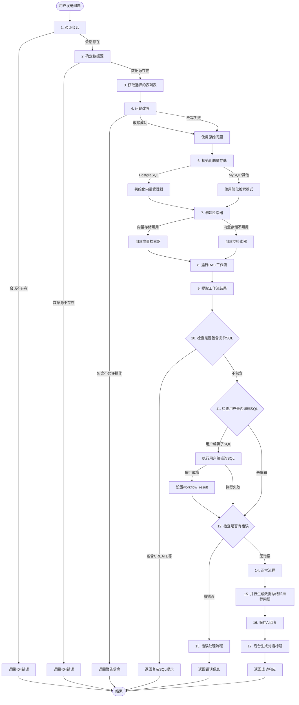
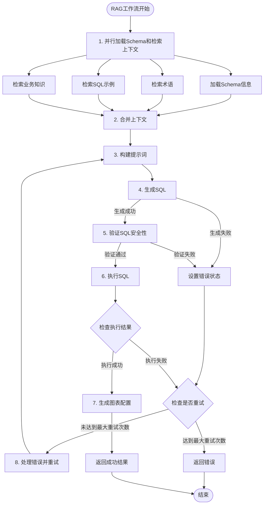
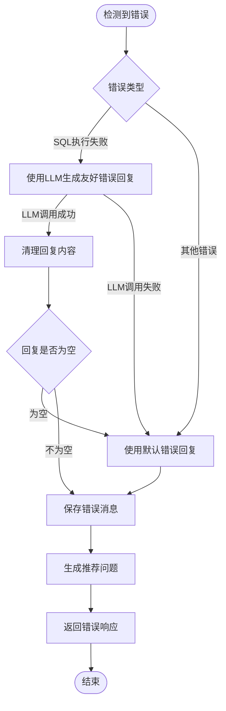

# 智能问数流程完整文档

## 概述

智能问数系统是一个基于RAG（检索增强生成）的SQL生成和执行系统，通过自然语言问题生成SQL查询，执行查询并返回结果。

## 主流程图



## RAG工作流详细流程



## 异常处理流程

### 1. 会话验证异常

**触发条件：**
- 会话不存在
- 会话不属于当前用户

**处理方式：**
```python
if not session:
    raise HTTPException(status_code=404, detail="会话不存在")
```

**返回结果：**
- HTTP 404错误
- 错误信息："会话不存在"

---

### 2. 数据源验证异常

**触发条件：**
- 数据源ID未指定
- 数据源不存在
- 数据源不属于当前用户

**处理方式：**
```python
if not data_source_id:
    raise HTTPException(status_code=400, detail="请指定数据源")
if not db_config:
    raise HTTPException(status_code=404, detail="数据源不存在")
```

**返回结果：**
- HTTP 400/404错误
- 相应的错误信息

---

### 3. 问题改写异常

**触发条件：**
- 问题包含不允许的操作（如查询所有数据明细、修改数据操作）

**处理方式：**
```python
warnings = rewrite_result.get("warnings", [])
if warnings:
    return ResponseModel(
        success=False,
        message="问题包含不允许的操作",
        data={
            "error": warnings[0],
            "warnings": warnings,
            "can_retry": True,
            "suggestion": "请修改您的问题..."
        }
    )
```

**返回结果：**
- success: False
- 包含警告信息和解决建议
- can_retry: True（允许重试）

**降级处理：**
- 如果问题改写服务失败，使用原始问题继续流程

---

### 4. 向量存储初始化异常

**触发条件：**
- 数据库不是PostgreSQL
- 向量存储管理器初始化失败

**处理方式：**
```python
if "postgresql" not in connection_string.lower():
    logger.info("向量存储功能需要PostgreSQL数据库，当前为MySQL。系统将使用简化检索模式")
    vector_manager = None
```

**降级处理：**
- 使用空检索器（EmptyRetriever）
- 系统继续运行，但检索精度可能降低

---

### 5. SQL生成异常

**触发条件：**
- LLM调用失败
- SQL生成失败
- SQL为空

**处理方式（在RAG工作流中）：**
```python
try:
    # 调用LLM生成SQL
    sql = self._call_llm(state["prompt"])
except Exception as e:
    error_msg = f"生成SQL失败: {str(e)}"
    state["execution_error"] = error_msg
    state["retry_count"] = state.get("retry_count", 0) + 1
```

**重试机制：**
- 最大重试次数：3次（可配置）
- 每次重试会在提示词中添加错误信息
- 达到最大重试次数后返回错误

---

### 6. SQL安全性验证异常

**触发条件：**
- SQL不是SELECT语句
- SQL包含危险关键字（DROP、DELETE、CREATE等）
- SQL可能查询所有数据明细（无WHERE、无LIMIT、无聚合函数）
- 检测到SQL注入模式

**处理方式：**
```python
def _validate_sql_safety(self, sql: str):
    # 只允许SELECT语句
    if not sql_upper.startswith("SELECT"):
        raise ValueError("只允许执行SELECT查询语句")
    
    # 检查危险关键字（使用正则表达式匹配单词边界）
    for keyword in dangerous_keywords:
        pattern = r'\b' + re.escape(keyword) + r'\b'
        if re.search(pattern, sql_upper):
            raise ValueError(f"禁止执行包含 {keyword} 的SQL语句")
```

**特殊处理：**
- 如果SQL包含CREATE等复杂逻辑，标记为`contains_complex_sql=True`
- 不执行SQL，但返回SQL给用户，允许手动执行

---

### 7. SQL执行异常

**触发条件：**
- SQL语法错误
- 表名或字段名不存在
- 数据类型不匹配
- JOIN条件错误
- 数据库连接失败
- 查询超时

**处理方式（在RAG工作流中）：**
```python
def _execute_sql(self, state: RAGState) -> RAGState:
    try:
        result = executor.execute(sql)
        if result["success"]:
            # 执行成功
            state["sql_execution_result"] = result
        else:
            # 执行失败
            error_msg = result.get("error", "SQL执行失败")
            state["execution_error"] = error_msg
            state["retry_count"] = state.get("retry_count", 0) + 1
    except Exception as e:
        error_msg = str(e)
        state["execution_error"] = error_msg
        state["retry_count"] = state.get("retry_count", 0) + 1
```

**重试机制：**
- 在错误处理节点中，将错误信息添加到提示词
- 重新生成SQL（最多重试3次）
- 如果达到最大重试次数，返回错误

**缓存处理：**
- SQL执行结果会被缓存（如果启用）
- 相同SQL的后续查询会从缓存获取结果

---

### 8. 用户编辑SQL执行异常

**触发条件：**
- 用户提供了编辑后的SQL
- 执行用户编辑的SQL失败

**处理方式：**
```python
if request.edited_sql:
    try:
        result = executor.execute(final_sql, user_id=current_user.id)
        if result["success"]:
            # 执行成功，设置workflow_result
            workflow_result["explanation"] = "..."
            workflow_result["data"] = data
            workflow_result["chart_config"] = chart_config
        else:
            # 执行失败，设置错误
            error = result.get("error", "SQL执行失败")
            execution_error = error
    except Exception as e:
        error = str(e)
        execution_error = error
```

**后续处理：**
- 如果执行失败，进入错误处理流程
- 如果执行成功，继续正常流程

---

### 9. 错误处理流程异常

**触发条件：**
- SQL执行失败（在RAG工作流中）
- 用户编辑的SQL执行失败
- 达到最大重试次数

**处理流程：**


**错误回复生成：**
1. 尝试使用LLM生成友好的错误回复
2. 如果LLM调用失败，使用默认错误回复模板
3. 确保error_content不为None（多重检查）

**返回结果：**
```python
return ResponseModel(
    success=False,
    message="SQL执行失败",
    data={
        "id": assistant_message.id,
        "sql": sql_to_return,
        "error": execution_error or error,
        "error_message": execution_error or error,
        "can_retry": True,  # 允许重试
        "can_continue_natural_language": True,  # 允许继续用自然语言提问
        "data": [],
        "data_total": 0,
        "recommended_questions": recommended_questions
    }
)
```

---

### 10. 数据总结生成异常

**触发条件：**
- 数据总结生成失败
- LLM调用失败

**处理方式：**
```python
try:
    data_summary_task = asyncio.create_task(generate_data_summary(...))
    data_summary, recommended_questions = await asyncio.gather(
        data_summary_task,
        recommended_questions_task,
        return_exceptions=True
    )
    
    if isinstance(data_summary, Exception):
        logger.warning(f"生成数据总结失败: {data_summary}，不影响主流程")
        data_summary = None
except Exception as e:
    logger.warning(f"并行生成数据总结和推荐问题失败: {e}，不影响主流程")
    data_summary = None
```

**降级处理：**
- 如果数据总结生成失败，设置为None
- 不影响主流程，继续保存消息和返回结果

---

### 11. 推荐问题生成异常

**触发条件：**
- 推荐问题生成失败
- LLM调用失败

**处理方式：**
```python
if isinstance(recommended_questions, Exception):
    logger.warning(f"生成动态推荐问题失败: {recommended_questions}，将返回空列表")
    recommended_questions = []
except Exception as e:
    logger.warning(f"生成推荐问题失败: {e}")
    recommended_questions = []
```

**降级处理：**
- 如果推荐问题生成失败，返回空列表
- 不影响主流程

---

### 12. 消息保存异常

**触发条件：**
- content字段为None
- 数据库连接失败
- 数据库约束违反

**处理方式：**
```python
# 多重检查确保content不为None
explanation_content = workflow_result.get("explanation") if workflow_result else None

if not explanation_content:
    if data and len(data) > 0:
        explanation_content = f"SQL查询执行成功，返回 {len(data)} 条数据"
    else:
        explanation_content = "SQL查询执行成功，但未返回数据"

if data_summary:
    explanation_content = f"{explanation_content}\n\n**数据分析总结：**\n{data_summary}"

# 最终检查
if not explanation_content or (isinstance(explanation_content, str) and explanation_content.strip() == ""):
    explanation_content = "SQL生成并执行成功"

final_content = explanation_content or "SQL生成并执行成功"

assistant_message = ChatMessage(
    session_id=session_id,
    role="assistant",
    content=final_content,  # 确保不为None
    ...
)
```

**异常捕获：**
```python
except Exception as e:
    db.rollback()
    error_msg = str(e)
    logger.error("发送消息失败: %s", error_msg, exc_info=True)
    raise HTTPException(status_code=500, detail=f"发送消息失败: {safe_error_msg}")
```

---

### 13. 对话标题生成异常

**触发条件：**
- 标题生成失败
- LLM调用失败
- 数据库会话问题

**处理方式：**
```python
async def generate_title_background():
    try:
        db_session = LocalSessionLocal()
        try:
            await generate_session_title(session, request.question, db_session, llm_client)
            db_session.commit()
        finally:
            db_session.close()
    except Exception as e:
        logger.warning(f"自动生成对话标题失败: {e}，保留原标题")

# 后台执行，不阻塞主流程
asyncio.create_task(generate_title_background())
```

**降级处理：**
- 如果标题生成失败，保留原标题
- 不影响主流程响应

---

## 关键组件说明

### 1. RAG工作流（RAGWorkflow）

**位置：** `backend/app/core/rag_langchain/rag_workflow.py`

**主要节点：**
1. `load_schema_and_retrieve_parallel`: 并行加载Schema和检索上下文
2. `merge_contexts`: 合并上下文
3. `build_prompt`: 构建提示词
4. `generate_sql`: 生成SQL
5. `execute_sql`: 执行SQL
6. `handle_error`: 处理错误并重试
7. `generate_chart`: 生成图表配置

**状态管理：**
- 使用LangGraph的StateGraph管理状态
- 状态包含：question、schema_info、sql、execution_result等

**重试机制：**
- 最大重试次数：3次（可配置）
- 每次重试会在提示词中添加错误信息
- 达到最大重试次数后返回错误

---

### 2. SQL执行器（SQLExecutor）

**位置：** `backend/app/core/rag_langchain/sql_executor.py`

**主要功能：**
1. SQL安全性验证
2. SQL参数化（防止SQL注入）
3. SQL执行（支持缓存）
4. 结果处理（数据脱敏、格式化）
5. 性能监控和审计日志

**安全特性：**
- 只允许SELECT语句
- 禁止危险关键字（使用正则表达式匹配单词边界）
- 检查SQL注入模式
- 参数化查询

**缓存机制：**
- 支持Redis缓存（如果可用）
- 降级到内存缓存（如果Redis不可用）
- 缓存TTL：10分钟（可配置）

---

### 3. 问题改写服务（QuestionRewriter）

**位置：** `backend/app/core/rag_langchain/question_rewriter.py`

**主要功能：**
1. 问题改写（优化用户问题表述）
2. 术语映射（业务术语 -> 数据库字段）
3. 安全检查（检测不允许的操作）

**改写规则：**
- 使用规则引擎进行改写
- 支持术语映射
- 检测危险操作（查询所有数据明细、修改数据操作）

---

### 4. 图表服务（ChartService）

**位置：** `backend/app/core/rag_langchain/chart_service.py`

**主要功能：**
- 根据查询结果自动生成图表配置
- 支持多种图表类型（table、bar、line、pie等）

---

## 性能优化

### 1. 并行执行

- **Schema加载和上下文检索**：使用线程池并行执行
- **数据总结和推荐问题生成**：使用asyncio.gather并行执行

### 2. 缓存机制

- **Schema信息缓存**：TTL 1小时
- **SQL执行结果缓存**：TTL 10分钟
- **Redis缓存**：如果可用，使用Redis；否则降级到内存缓存

### 3. 连接池

- **数据库连接池**：复用数据库连接
- **连接池大小**：可配置（通过环境变量）

---

## 日志和监控

### 1. 性能监控

- 使用`track_time`装饰器记录各步骤耗时
- 记录SQL执行时间
- 记录完整流程耗时

### 2. 审计日志

- SQL查询审计（记录SQL、执行时间、行数、用户ID等）
- 错误日志记录

### 3. 调试日志

- 详细的步骤日志（步骤1-6）
- 错误检查日志
- 工作流状态日志

---

## 总结

智能问数系统采用多层异常处理机制，确保系统在各种异常情况下都能正常工作：

1. **输入验证**：会话、数据源、问题验证
2. **重试机制**：SQL生成和执行失败时自动重试（最多3次）
3. **降级处理**：向量存储、数据总结、推荐问题生成失败时降级处理
4. **错误回复**：使用LLM生成友好的错误回复，失败时使用默认模板
5. **多重检查**：确保关键字段（如content）不为None
6. **后台任务**：对话标题生成在后台执行，不阻塞主流程

所有异常都被妥善处理，系统能够优雅地降级或返回友好的错误信息，确保用户体验。

